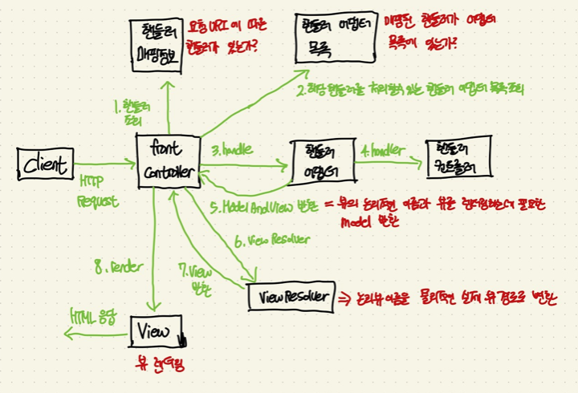

# 스프링 인 액션 1~5장 정리

## Chapter 01 - 스프링 시작하기

### @SpringBootApplication

`@SpringBootApplication`은 이 클래스가 스프링 부트 애플리케이션임을 나타낸다. 즉, JAR 파일을 통해서 애플리케이션을 실행하면 이 부트스트랩 클래스가 제일 먼저 시작된다. 

`@SpringBootApplication`은 다음 세 개의 애노테이션이 결합한 애노테이션이다.
 
#### 1. `@SpringBootConfiguration`

해당 클래스가 스프링 부트 애플리케이션의 구성 클래스라는 것을 뜻한다. @Configuration과 거의 유사한 애노테이션이며 다른점은 @SpringBootConfiguration 애노테이션은 구성들을 자동 등록할 수 있고 @Configuration은 아니다. 

**@SpringBootConfiguration**

```java
@Target(ElementType.TYPE)
@Retention(RetentionPolicy.RUNTIME)
@Documented
@Configuration
public @interface SpringBootConfiguration {

}
```

**@Configuration**

```java
@Target(ElementType.TYPE)
@Retention(RetentionPolicy.RUNTIME)
@Documented
@Component
public @interface Configuration {

}
```
 
#### 2. `@EnableAutoConfiguration`

`애플리케이션 컨텍스트`의 **자동-구성을 활성화**한다는 뜻이다. 즉, 우리가 필요로 하는 빈 또는 컴포넌트들을 자동으로 구성하도록 스프링 부트에게 알려준다. 예를들어 우리는 다음과 같이 커스텀하게 DataSource를 구성하여 애플리케이션 컨텍스트의 빈으로 등록할 수 있다. 그러나 스프링 부트는 이미 자동-구성으로 DataSource() 메서드를 구성해주기 때문에 **기본값**을 사용한다면 이 메서드를 빈으로 등록할 필요가 없게된다.

```java
@Bean
public DataSource dataSource(){
	return EmbeddedDatabaseBuilder()
		.setType(EmbeddedDatabaseType.H2)
		.addScript("schema.sql")
		.addScript("user_data.sql", "ingredient_data.sql")
		.build();
}

```

#### 3. `@ComponentScan`

컴포넌트 검색을 활성화한다. @Component, @Controller, @Repository 등의 애노테이션이 붙어있는 클래스들을 자동으로 찾아서 스프링 컨테이너에 컴포넌트로 등록한다. 따로 기본 패키지를 설정하지 않는다면, 현재 부트스트랩 패키지를 포함한 하위 패키지에 있는 컴포넌트들을 모두 빈으로 등록한다. 또한, 컴포넌트(빈) 객체로 등록하지 않을 애노테이션이나 추가적으로 등록할 커스텀 애노테이션을 추가할 수 있다.

## Chapter 02 - 웹 애플리케이션 개발하기

챕터 2에서 우리는 서버-클라이언트 모델에 따라서 웹 요청을 처리해서 사용자에게 화면을 보여주는 기능을 만들었다. 여기서 중요한 핵심은 사용자의 요청에 따라 어떻게 처리하는 지에 관한 흐름일 것이다.

전체적인 스프링 MVC 의 내부 동작원리는 다음과 같다.



이 내부 동작원리에서 핸들러에서 처리하는 흐름을 살펴볼건데, 한 가지 예시로 식자재 데이터를 보여주는 폼을 요청하는 부분을 살펴보자.

`/design` 의 URL 요청을 `HTTP GET Method`로 처리하는 핸들러(컨트롤러)이다. 여기서는 식자재 데이터 폼을 사용자에게 보여주기 위해서 데이터베이스에서 식자재 데이터를 모두 조회해서 리스트에 담고, 담은 리스트를 같은 타입의 식자재끼리 묶어서 모델에 담아서 뷰에 전달하게 된다.

```java
    @GetMapping("/design")
    public String showDesignForm(Model model){
        // TODO : 식자재 데이터를 모두 조회해서 리스트에 담기
        List<Ingredient> ingredients = new ArrayList<>();
        ingredientRepository.findAll().forEach(ingredients::add);

        // TODO : 같은 타입끼리 모델에 담기 -> (type, List<Ingredient>)
        Type[] types = Type.values();
        for (Type type : types) {
            model.addAttribute(type.toString().toLowerCase(),
                    filterByType(ingredients, type));
        }

        return "design";
    }
```

또 하나의 예시로 식자재 폼을 처리하는 부분을 살펴보자.

/design 의 URL 요청을 HTTP POST Method로 처리하는 핸들러(컨트롤러)이다. 여기서는 사용자가 식자재 데이터를 담아서 저장 요청을 하면 처리하는 역할을 수행한다. 이 핸들러는 식자재 데이터 폼에 대한 검증을 수행하고, 검증이 완료되면 데이터베이스에 데이터를 저장하고 주문 엔티티에도 저장한다. 그 다음에 모든 로직이 종료되면 사용자에게 특정 화면으로 이동하게 한다.

```java
    @PostMapping
    public String processDesign(@Valid @ModelAttribute Taco design, @ModelAttribute Order order, Errors errors){
        if(errors.hasErrors()){
            return "design";
        }

        Taco saved = tacoRepository.save(design);
        order.addDesign(saved);

        return "redirect:/orders/current";
    }
```

## Chapter 03 - 데이터로 작업하기

우리는 3장에서 다양한 데이터베이스 접근기술을 학습하였다. 여러가지 데이터베이스 접근기술 중에 JPA를 사용해서 정리를 해볼까 한다.

밑의 소스코드는 타코 엔티티이다. JPA를 사용하면 **데이터베이스 테이블과 매핑할 JAVA 객체**에 `@Entity` 애노테이션을 달기만 하면된다. 그런다음 기본키 필드를 설정하고 기본키 생성전략을 선택한다. 여러가지 컬럼들은 클래스 멤버변수에 자동으로 매핑된다. 만약에 컬럼의 이름을 변경하고 싶다면 `@Column`을 멤버변수에 달아주고 이름 속성을 변경해주면 된다. 또한 다른 엔티티와의 연관관계를 설정하고 싶다면 `@ManyToOne`, `@OneToMany` 같은 애노테이션을 달아주어 설정해주면 된다.

```java
@Getter @Setter
@Entity
public class Taco {

    @Id @GeneratedValue(strategy = GenerationType.AUTO)
    private Long id;
    private Date createdAt;

    @NotNull(message = "이름은 5글자 이상 입력해주세요")
    @Size(min = 5, message = "Name must be at least 5 characters long")
    private String name;

    @ManyToMany(targetEntity = Ingredient.class)
    @Size(min = 1, message = "You must choose at least 1 ingredient")
    private List<Ingredient> ingredients;

    @PrePersist
    void createdAt(){
        this.createdAt = new Date();
    }
}
```

위에서 테이블과 매핑할 엔티티를 설정하고 실제로 접근해야할 것이다. 스프링 데이터 JPA는 다음과 같이 인터페이스를 상속받기만 하면 기본적인 CRUD와 여러가지 SQL문을 자동으로 구현해준다.

오직 제네릭의 첫 번째 요소를 엔티티 객체를 넣어주고, 두 번째 요소는 PK값의 자료형을 매핑해주면 된다.

```java
public interface TacoRepository extends CrudRepository<Taco, Long> {}
```

## Chapter 04 - 스프링 시큐리티

다양한 애플리케이션은 해킹에 대한 위험 때문에 보안을 철저히 해야한다. 예를들어 관리자만 접근할 수 있는 HTTP 요청경로는 관리자만 접근이 가능해야 한다.

스프링 시큐리티는 이런 보안적인 요소들을 자동으로 구성해주고 편리하게 구성할 수 있게 제공해준다.

### 인증 절차 인터페이스 - UserDetailsService, UserDetails

UserDetailsService 인터페이스는 DB에서 유저 정보를 가져오는 역할을 한다. 해당 인터페이스의 메서드에서 DB의 유저 정보를 가져와서 AuthenticationProvider 인터페이스로 유저 정보를 리턴하면, 그 곳에서 사용자가 입력한 정보와 DB에 있는 유저 정보를 비교한다.

#### UserDetails

스프링 시큐리티에서 **사용자의 정보를 담는 인터페이스**이다. 우리가 이 인터페이스를 구현하면 스프링 시큐리티에서 구현한 클래스를 사용자 정보를 인식하고 인증 작업을 하게된다. 쉽게 말하면 UserDetails 인터페이스는 VO 역할을 한다고 보면된다. 

UserDetails 인터페이스를 구현하면 오버라이드되는 메서드들이 있는데, 다음과 같다.

- `getAuthorities()` : 계정이 갖고있는 권한 목록을 반환한다.
- `isAccountNonExpired()` : 계정이 만료되지 않았는지 반환한다. (true : 만료안됨)
- `isAccountNonLocked()` : 계정이 잠겨있지 않았는지 반환한다. (true : 잠기지 않음)
- `isCredentialNonExpired()` : 비밀번호가 만료되지 않았는지 반환한다. (true : 만료안됨)
- `isEnabled()` : 계정이 활성화(사용가능)인지 반환한다. (true : 활성화)

#### UserDetailsService

사용자 정보를 담을 객체를 만들었으니, DB에서 유저정보를 직접 가져오는 인터페이스를 구현해보자. UserDetailsService 인터페이스에는 DB에서 유저 정보를 불러오는 중요한 메서드가 존재한다. 바로 `loadUserByUsername()` 메서드이다. 이 메서드에서 유저 정보를 불러오는 작업을 하면 된다.

우리가 구현한 `UserRepositoryUserDetailsService` 는 다음과 같이 구성된다.

```java
@Service
@RequiredArgsConstructor
public class UserRepositoryUserDetailsService implements UserDetailsService {

    private final UserRepository userRepository;

    @Override
    public UserDetails loadUserByUsername(String username) throws UsernameNotFoundException {
        return userRepository.findByUsername(username)
                .orElseThrow(() -> new UsernameNotFoundException("User '" + username + "' not found"));
    }
}
```

### 커스텀 명세 서비스를 스프링 시큐리티에 구성

위에서 작성한 코드가 스프링 시큐리티에 의해서 자동으로 동작하도록 하려면 시큐리티 구성 클래스에 다음과 같이 추가해야 한다. 또한, 비밀번호를 암호화해서 DB에 저장되도록 구성도 하였다.

이렇게 설정정보를 구성하고 회원가입 및 로그인 페이지를 구성하기만 하면 스프링 시큐리티가 정상적으로 동작하는 것을 확인할 수 있을 것이다.


```java
    @Autowired private UserDetailsService userDetailsService;

    // TODO : 사용자 비밀번호가 암호화되어 DB에 저장되도록 인코더 구성
    @Bean
    public PasswordEncoder encoder(){
        return new BCryptPasswordEncoder();
    }

    @Override
    protected void configure(AuthenticationManagerBuilder auth) throws Exception {
        auth.userDetailsService(userDetailsService)
                .passwordEncoder(encoder());
    }
```

### 웹 요청 보안 처리하기

우리는 위에서 사용자 정보를 안전하게 관리하는 스프링 시큐리티 구성법을 알아보았다. 이번에는 사용자의 웹 요청에 따라서 접근을 제한하는 것 등 다양한 웹 요청 보안을 처리하는 방법을 알아볼 것이다.

웹 요청 보안을 처리하려면 `HttpSecurity`인자를 포함하는 `configure()`메서드를 오버라이딩하여 구현해야한다. 

우리가 구성한 웹 요청 보안처리 코드는 다음과 같다.

```java
    @Override
    protected void configure(HttpSecurity http) throws Exception {
        http.authorizeRequests()
                .antMatchers("/design", "/orders")
                    .access("hasRole('ROLE_USER')")
                .antMatchers("/", "/**")
                    .access("permitAll")
                .and()
                    .formLogin()
                    .loginPage("/login")
                .and()
                    .logout()
                    .logoutSuccessUrl("/")
                .and()
                    .csrf();
    }
```

우리가 구성한 웹 요청 보안처리는 요약하면 다음과 같다.

- `/design`, `/orders` URL에 클라이언트 요청이 발생하면 ROLE_USER 권한을 가진 사람만 접근을 허가한다.
- 위 URL을 제외한 **나머지 웹 요청은 모두 접근을 허**가한다.
- **커스텀 로그인 페이지를 구성**하고, 로그인 페이지 URL은 `/login` 이다.
- 커스텀 로그아웃을 할 수있게 구성하고, 성공적으로 **로그아웃이 되면 홈으로 돌아간다.**
- **CSRF 공격을 방어**하는 기능을 추가한다.