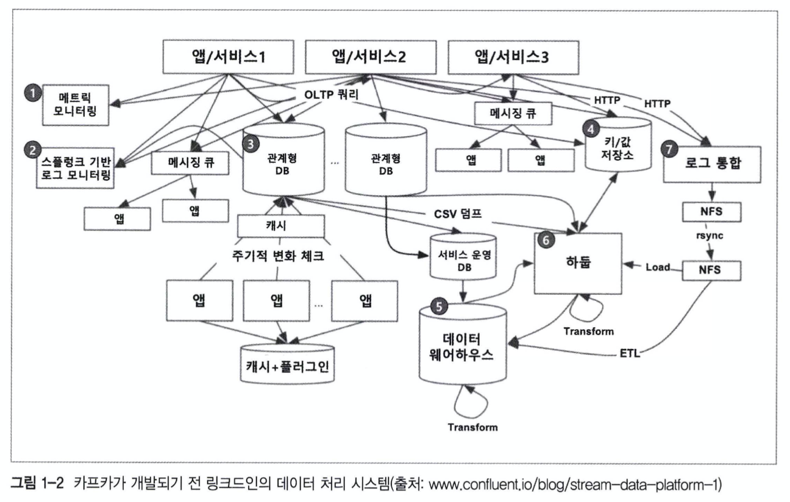
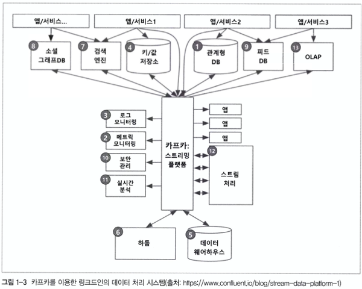
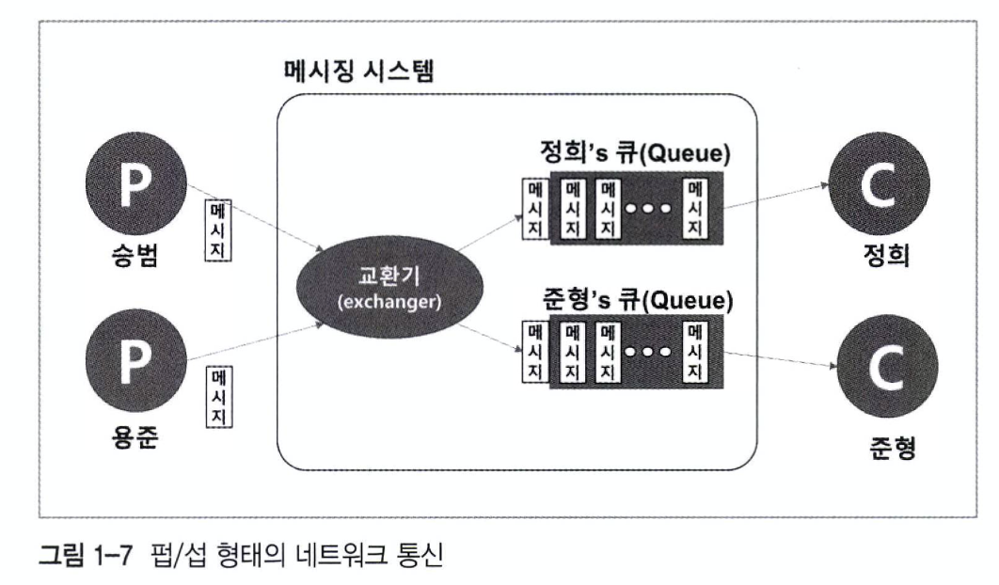
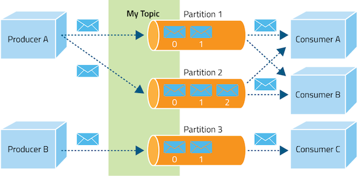
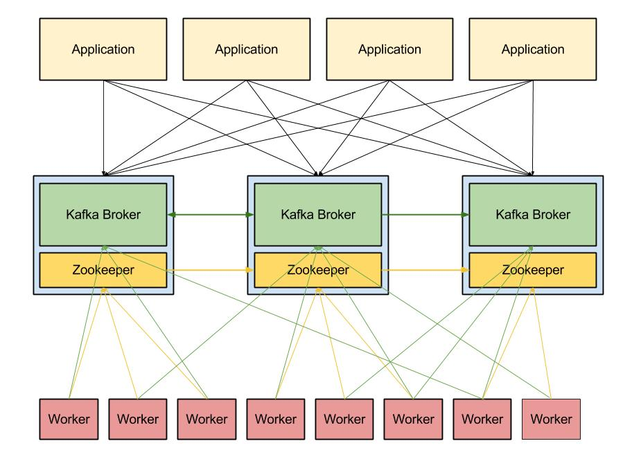

# 카프카 사용하기

### Apache Kafka 란?

- `메시징 시스템`
- 대용량, 대규모 메시지 데이터를 빠르게 처리할 수 있는 메시징 시스템이다.
- 링크드인에서 시작했으나 현재는 **아파치 공식 오픈소스**이다.

### 링크드인이 카프카를 만든 이유?

기존의 `end-to-end` 연결 방식 아키텍처의 많은 문제점을 해결하기 위해서

- 통합/중앙화된 전송 영역이 없다 -> end-to-end 연결이 갈수록 복잡해졌다.
- 문제 발생시 관련 여러 시스템을 확인해야 한다. -> 문제 해결이 어려워졌다.
- 데이터 파이프라인 관리의 어려움
- 연결된 시스템마다 제각기 다른 방식으로 구현할 수 있다. -> 파이프라인 통합(확장)이 어렵다.

이런 문제를 해결하기 위해서

- **모든 시스템으로 데이터를 전송**할 수 있고
- **실시간** 처리가 가능하고
- 급속도로 성장하는 서비스를 위해 확장이 용이한

시스템을 만드는 것을 목표로 잡았다.

### 카프카 개발팀의 목표

1. 프로듀서와 컨슈머의 분리
2. 메시징 시스템과 같이 영구 메시지 데이터를 여러 컨슈머에게 허용한다. -> 높은 처리량을 위한 메시지를 최적화
3. 데이터가 증가함에 따라서 **scale-out이 가능한 시스템**
4. end-to-end 방식 -> 이벤트/데이터의 흐름을 **중앙에서 관리하는 방식**으로 바꾸었다.

**end-to-end 방식**

**이벤트/데이터의 흐름을 중앙에서 관리하는 방식**

### 카프카의 동작방식과 원리

카프카는 pub/sub 모델을 기반으로 만들어진 메시징 시스템이다.

> 메시징 시스템: 로그 데이터, 이벤트 메시지 등 API 로 호출할 때 보내는 데이터들을 관리하는 시스템이다.

>pub/sub 모델: 중앙에 메시징 시스템 서버를 두고 메시지를 보내고(Publish), 받는(subscribe) 형태의 통신 구독을 신청한 수신자만 메시지를 전달받을 수 있다. 장점은 개체가 빠져나가거나 수신 불능이 되어도 메시징 시스템만 살아있다면 전달한 메시지가 유실되지 않고, N:M으로 연결되는 것이 아니기 때문에 확장성이 용이하다.(기존 네트워크 통신 방법의 극복)

동작 방식을 간단히 정리하면 

1. 프로듀서가 새로운 메시지를 카프카로 보낸다.
2. 프로듀서가 보낸 메시지는 카프카에 컨슈머 큐에 도착해 저장된다.
3. 컨슈머는 카프카 서버에 접속하여 새로운 메시지를 가져간다.

용어 정리

- 카프카: 아파치 프로젝트 애플리케이션 이름, 클러스터 구성이 가능해서 카프카 클러스터라고 부른다.
- 브로커: 카프카 애플리케이션이 설치되어 있는 서버 또는 노드
- 토픽: 메시지 그룹, 프로듀서와 컨슈머들이 카프카로 보낸 자신들의 메시지를 구분하기 위한 이름으로 사용한다. 많은 수의 프로듀서, 컨슈머들이 동일한 카프카를 이용하게 된다면 메시지들이 서로 뒤섞여 각자 원하는 메시지를 얻기가 어려워진다. 따라서 토픽이라는 이름으로 구분해서 사용한다.
- 파티션: 병렬처리가 가능하도록 토픽을 나눌수 있고, 많은 양의 메시지를 처리하기 위해 파티션의 수를 늘릴수 있다.
- 프로듀서: 메시지를 생산하여 브로커의 토픽 이름으로 보내는 서버 또는 애플리케이션을 말한다.
- 컨슈머: 브로커의 토픽 이름으로 저장된 메시지를 가져가는 서버 또는 애플리케이션을 말한다.

### pub/sub 모델의 장/단점

**장점**

- 기존 네트워크 통신 방식의 단점 극복
- 개체가 빠지거나 수신 불능이 되어도, 메시징 시스템만 살아있으면 전달한 메시지가 유실되지 않는다.
- N:M으로 연결되는 것이 아니기 때문에 확장성이 용이하다.

**단점**

- 직접 통신하는 것이 아니기 때문에 메시지가 정확하게 전달되었는지 확인하려면 코드가 복잡해진다.
- 메시징 시스템이 있기 때문에 메시지 전달속도가 느리다.

### 카프카는 기존 메시징 시스템의 한계를 어떻게 극복하였을까?

#### 기존 메시징 시스템

1. 목적: 간단한 이벤트(n KB 정도의 크기) 전송
2. 특징
	- 메시지 보관, 전달 과정에서 속도, 용량보다 신뢰성 보장을 중요하게 여긴다.
	- 많은 양의 데이터를 관리하지 못한다.(메시징 시스템 교환기의 부하, 컨슈머 큐를 직접 관리, 메시지의 정합성, 전달결과 관리등을 위해서 프로세스가 복잡하고 다양했기 때문에 -> 데이터를 모으고 전달함에 있어서 성능 이슈 발생)

#### 극복 방법

1. 메시지 교환 전달의 신뢰성 관리를 프로듀서, 컨슈머 쪽으로 넘김
2. 부하가 많이 걸리는 교환기 기능을 컨슈머가 만들 수 있게 한다.
	- 메시징 시스템 내의 작업량이 줄어든다.
	- 절약한 작업량을 메시징 전달 성능에 집중시킨다.
	- 이에 따라서 고성능 메시징 시스템을 만들 수 있었음

### 카프카의 특징

#### 1. 프로듀서와 컨슈머의 분리

- pub/sub 방식을 통해서 메시지를 보내는 역할과 받는 역할이 완벽하게 분리되었다. -> 다른 시스템, 서비스 서버의 상태와 관계없이 그저 메시지 시스템과 메시지 기반 송/수신을 하면 된다.

#### 2. 멀티 프로듀서, 멀티 컨슈머

- 하나 이상의 토픽에 여러 프로듀서 또는 컨슈머들이 접근 가능한 구조이다. -> 이를 통해서 카프카는 중앙 집중형 구조로 구성할 수 있다.

#### 3. 프로듀서는 1개 이상의 토픽으로 메시지 전송이 가능

- 컨슈머는 1개 이상의 토픽에서 메시지를 가져올 수 있다.
- 이처럼 멀티 기능이 필요한 이유는 데이터 분석 및 처리 프로세스에서 하나의 데이터를 다양한 용도로 사용하는 요구가 많아졌기 때문이다.

#### 4. 디스크에 메시지를 저장

- 기존 메시징 시스템(RabbitMQ, ActiveMQ): 컨슈머가 메시지를 읽어가면 큐에서 바로 삭제
- 카프카: 보관 주기동안 메시지를 디스크에 저장한다. -> 트래픽이 폭주하여 컨슈머의 처리가 늦어져도 카프카 디스크에 안전하게 보관된다.(메시지 손실 X)

> 디스크 I/O 는 느리지 않을까? 카프카는 페이지 캐시를 이용하여 디스크 접근을 최소화시켜서 처리속도가 빠르다.

#### 5. 시스템 확장성에 용이

- 분산 시스템 기반으로 설계 -> 분산 시스템 구성 및 복제에 대한 설정을 쉽게 구성할 수 있다.
- 수십 대의 브로커로 간단하게 확장이 가능하다.(1개의 카프카 클러스터는 초기에 3개로 시작한다.)
- 확장 시 서비스의 중단 없이 온라인 상태에서 확장이 가능하다.

#### 6. 높은 성능

- 분산 처리가 가능하다. -> 하나의 서버/노드에서 장애가 발생하면 다른 서버/노드가 대신 처리가 가능하다.

- 배치 처리가 가능하다.
	- 서버와 클라이언트간에 데이터를 주고받는 상황이라면 I/O가 발생한다. -> 네트워크 I/O, 디스크 I/O가 자주 일어나 서버의 속도를 저하한다.
	- 이러한 문제점을 크기가 작은 I/O를 그룹핑해서 처리할 수 있도록 배치작업을 통해서 처리하였다.
- TCP 기반의 프로토콜을 이용하여 오버헤드가 감소하였다.
	- AMQP 프로토콜을 사용하지 않았다. -> 기존의 메시징 시스템과 달리 프로토콜로 인한 오버헤드는 없도록 설계하였다.
